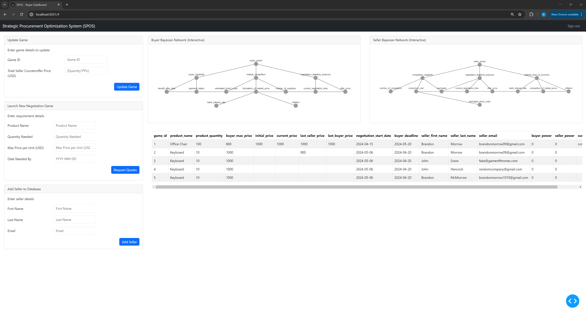
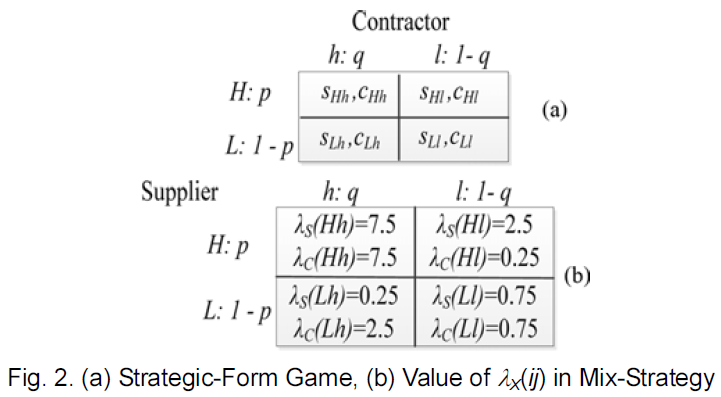
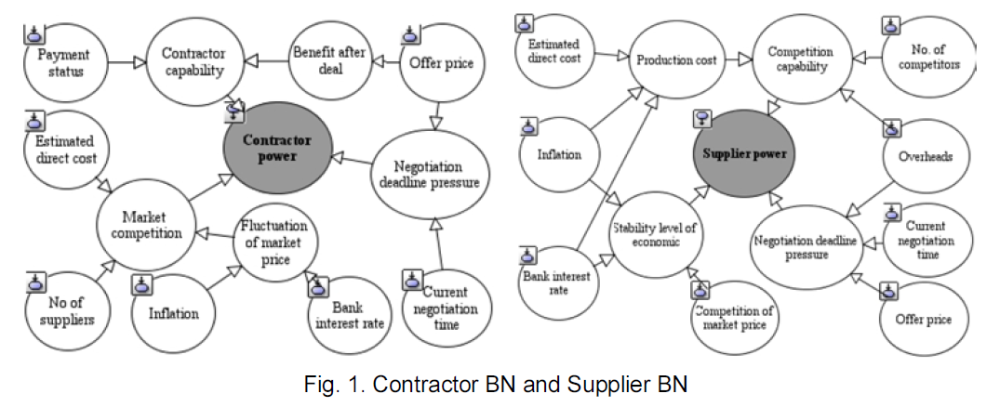

# Strategic Procurement Optimization System (SPOS)

This system utilizes an application of game theory called Bayesian Fuzzy Games to optimize supplier negotiations when purchasing. This game theory model implements a Bayesian Mixed strategy game that considers external factors on negotiations. Currently external factors are not considered in this version, and the mixed strategy game theory determines the counteroffer price. The bayesian network will be updated to count external factors in the negotiation. 

This system integrates with email, and can send emails. It currently cannot read emails as this will be added at a later date.  

# Dash App
The frontend data visualization dashboard
The web application:  
  

Here on the home screen you can see the external factors that influence negotiations through the Bayesian Networks on our two plots on the top. These will show the values of each external factors as they are added to our system. Below that is a table that tracks the status of each game, and gives information on the games.  

On the left hand side of the screen there are three forms that allow you to update game, launch a new negotiation game, and add sellers to the database. 
- Add seller allows the user to add a seller to the database. 
- Update game allows the user to enter the counteroffer price from a seller for a specific game, and it will tell the user the recommended counteroffer price to send the seller. The game ID is located in the subject line of all emails from the system. 
- The launch new negotiation game form allows the user to enter a requirement, and when they hit request quotes the system will email all sellers in the database requesting quotes for the new need. 

# How to Run
Ensure docker is installed on your computer. There will be two docker containers. One for the database, and one for the dash webpage. To run on docker enter the command line and enter:

### How to setup the docker database
1. docker run --name spos_postgres -p 5432:5432 -e POSTGRES_PASSWORD=spos123 -d postgres
2. docker exec -it spos_postgres bash
3. su - postgres
4. psql
5. CREATE DATABASE default_company;
6. \c default_company
7. Run rest of SQL

### (optional) To get pgAdmin4 to run
1. docker run -p 5050:80 -e "PGADMIN_DEFAULT_EMAIL=(your email)@gmail.com" -e "PGADMIN_DEFAULT_PASSWORD=admin" -d dpage/pgadmin4
2. Connect the containers with:
3. name: spos_postgres
host: host.docker.internal
database: postgres
user: postgres
password: spos123

# Backend
##  Game Logic 
Contains the bayesian fuzzy game logic, and contains the following classes:
### Negotiation Game  
This is a two player mixed strategy negotiation game. This is a game under incomplete information since we do not know the opponents reservation price or deadline. To make up for this lack of information we can predict their strategy using our game theory model. In this class we calculate the sellers utility from the following payoff matrix:  
  
Source: See [2] Below

All games start with mixed strategy probabilities $p=0.5$ and $q=0.5$. In this class $\lambda$ is the utility and  represents the strategy, and is used in the calculate. Please see the pdf file titles SPOS mathematics for an in depth explanation of the game theory mathematics used in this web application. 
### Bayesian Network:  
Contains the Bayesian Network logic following this DAG:  
  
Source: See [2] Below  

This network is used to calculate the influence of external factors on negotiation. This class returns a probability with 1 being external factors have no influence on the negotiators negotiation power, and 0.1 meaning external factors have a large influence on the negotiators negotiation power. 

## Data Service
Controls access to the database and uses SQLAlchemy ORM to interact with the database. Has all functions for creating, reading, updating, or deleting (CRUD) in the data_service.py file. The models.py contains the object relational mapping from the database to pythong objects. 

##  Email Service
Controls the sending and receiving of emails. Would be switched with an email service in productions, but for now uses python and a gmail account, but could be substituted for anything

# Database
## Daily Data Collection
The daily database updating DAG has not yet been implemented, and will be implemented to allow for daily updating of the influence of external factors on a negotiation. 

## References
[1] Gwak, J. and Sim, K. M. (2011). “Bayesian learning based negotiation
agents for supporting negotiation with incomplete information.” The
International MultiConference of Engineerings and Computer
Scientist, IMECS, HongKong, IEEE, pp. 163-168.

[2] Leu, S.-S., Hong Son, P. V., & Hong Nhung, P. T. (2014). Optimize negotiation price in
construction procurement using Bayesian Fuzzy Game Model. KSCE Journal of Civil
Engineering, 19(6), 1566–1572. https://doi.org/10.1007/s12205-014-0522-2
 